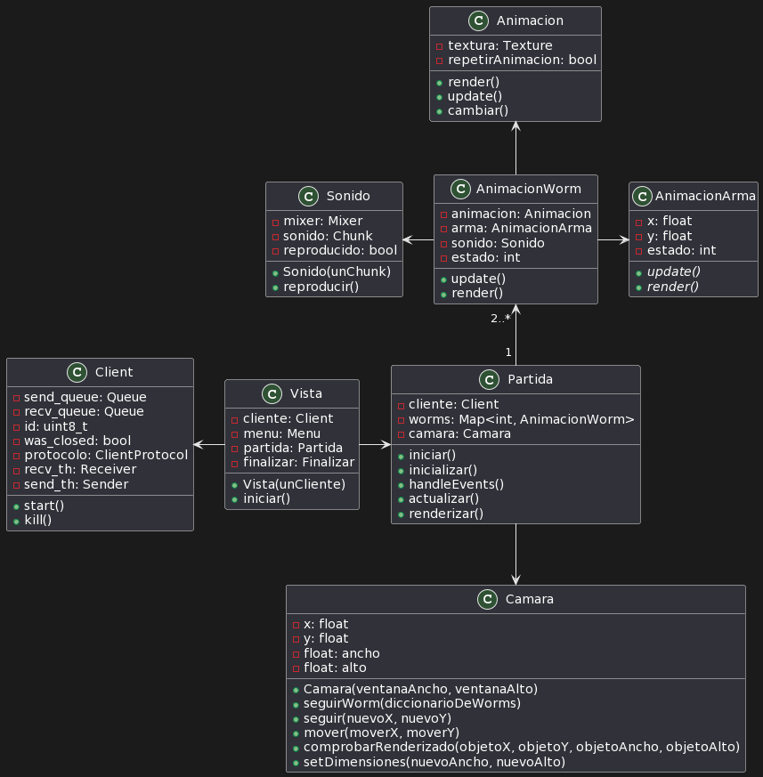
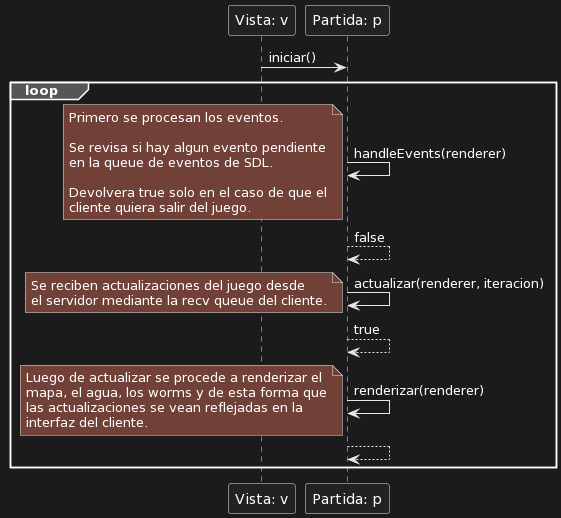
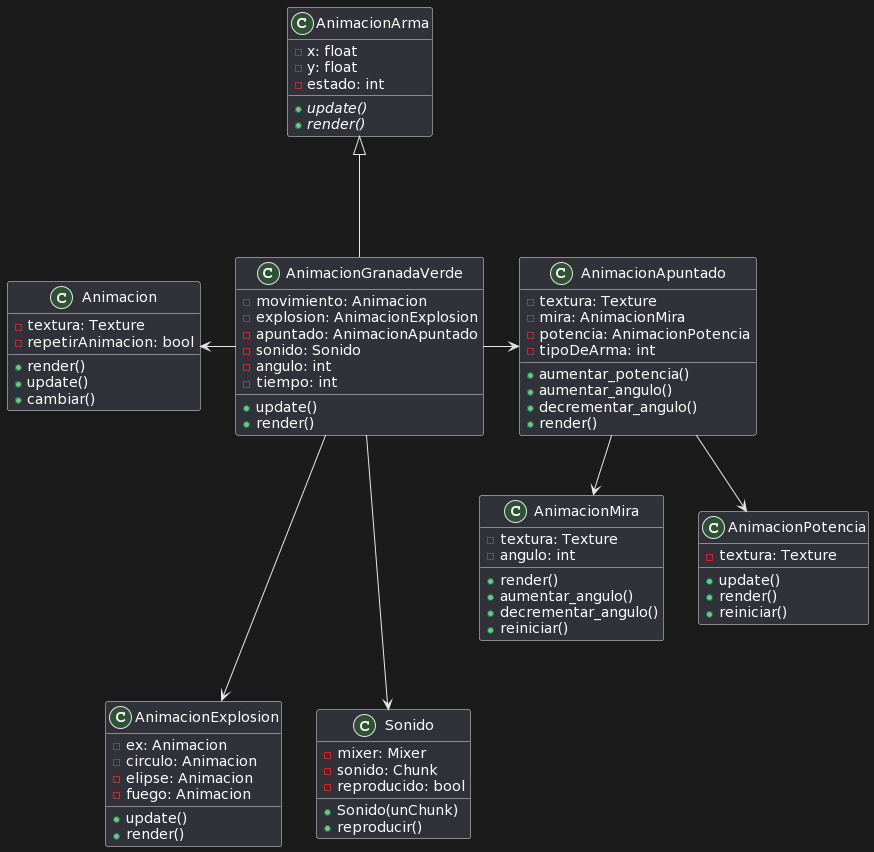
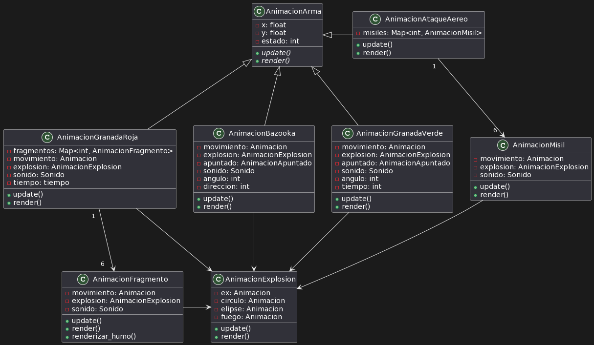

# Documentación técnica

El proyecto está compuesto por 3 partes: la interfaz de usuario, el protocolo y el servidor, cada una de las cuales a su vez está compuesta por más partes.

## Diagrama general

`PONER DIAGRAMA DE CLASES`

## DTOs

Los DTOs son un conjunto de clases de las cuales todas heredan de DTO. Este tipo de objeto es utilizado para contener los distintos mensajes/acciones que envia el cliente hacia el servidor o el servidor hacia el cliente. Fue creado con el objetivo de tener un tipo comun para almacenar en las colas de entrada y salida. A su vez, es para abstraer a las clases de conocer su formacion, solo la conocen las clases que los utilizan. 
El **DeadDto** es un DTO particular, ya que su funcion no es comunicar entre clientes y servidor sino que su funcion es que los hilos de entrada y salida salgan del loop de enviado de mensajes, es lo equivalente a informar que no se enviaran mas mensajes de un lado u del otro ni tampoco se recibiran. Esto evita lanzar una excepcion y tener que catchearla.

## Broadcaster
Se encarga de distribuir los mensajes recibidos por el juego `Game` a todos los clientes que estan en la partida.
Estos mensajes pueden ser de envio de actualizaciones del juego, o tambien de cierre.

## Server monitor outgoing queues
Se encarga de monitorear a la lista de colas que posee el broadcaster.
Teniendo un diccionario donde la clave es el id del cliente y el elemento almacenado es la cola de salida del cliente.

----

## Interfaz de usuario

### Cliente
Es la clase encargada de encapsular los atributos necesarios para que el cliente entable una conversacion con el **servidor**. Tiene un socket y dos colas, una de entrada y otra de salida. 
Ambas colas seran manipuladas por la partida, de la cola de entrada la partida extraera datos y de la cola de salida la partida insertara acciones para comunicarse con el servidor.

#### Recibidor `(client_receiver)`
> Es un hilo

Es la clase encargada de realizar un loop donde se comunica con el **ProtocoloCliente** donde le devuelve una salida `DTO` y el recibidor lo encola en la cola de entrada.

#### Enviador `(client_sender)`
> Es un hilo

Es la clase encargada de realizar un loop donde se comunica con el **ProtocoloCliente**. Se encarga de desencolar los datos `(Dto)` que estan en la cola de salida, para enviarselos al protocolo y que este se encargue de interpretarlos y luego enviarlos al servidor.

### Menu

El menu del juego se divide en tres clases implementadas con QT:
- MenuPrincipal.
- MenuPartidas.
- MenuCrearPartida.

#### Menu principal

Esta clase es una interfaz grafica que representa la ventana del menu principal en el juego. 

Basicamente le muestra al jugador dos opciones:
- Unirse a una partida creada.
- Crear una nueva partida.

Internamente guarda una referencia al cliente.

Se utiliza la funcion conect() de QT para establecer una conexion entre una señal y un metodo:
- Cuando el boton 'partidasButton' es presionado se emite la señal 'clicked' y se llama al metodo 'menuPartidas' que crea una instancia de la clase MenuPartidas.
- Cuando el boton 'crearPartidaButton' es presionado se emite la señal 'clicked' y se llama al metodo 'menuCrearPartida' que crea una instancia de la clase MenuCrearPartida.

Luego de instanciar la clase correspondiente, llama al metodo show() para mostrar la ventana y oculta la ventana del menu principal.

#### Menu de partidas

Esta clase es una interfaz grafica que representa la ventana del menu de seleccion de partidas en el juego. 

Basicamente le muestra al jugador las partidas a las cuales puede unirse. 

Para poder hacer esto, internamente guarda una lista de las partidas las cuales obtiene mediante el cliente.

Se utiliza la funcion conect() de QT para establecer una conexion entre una señal y un metodo. Cuando el boton 'elegirPartidaButton' es presionado se emite la señal 'clicked' y se llama al metodo 'elegirPartida'.

Internamente cuando se llama al metodo 'elegirPartida' se pushea en la *send_queue* una instancia de la clase 'ListaDePartidas' con el ID de la partida seleccionada.

Luego, se cierra la ventana.

#### Menu de creacion de partidas

Esta clase es una interfaz grafica que representa la ventana del menu de creacion de partidas en el juego. 

Basicamente le permite crear partidas al jugador.

Se utiliza la funcion conect() de QT para establecer una conexion entre una señal y un metodo. Cuando el boton 'nuevaPartidaButton' es presionado se emite la señal 'clicked' y se llama al metodo 'crearPartida'.

Internamente cuando se llama al metodo 'crearPartida' se pushea en la *send_queue* una instancia de la clase 'NuevaPartida' con la cantidad de jugadores y el ID del mapa.

Luego, se cierra la ventana.

#### Partida

Es la encargada de manejar la interfaz grafica de una partida. Se encarga de:

- Manejar los eventos.
- Actualizar.
- Renderizar.

A continuacion podemos ver un diagrama de secuencia simple que muestra lo dicho anteriormente:

En esta clase podemos encontrar un game loop cuya implementacion se basa en un loop a rate constante con drop de frames.

Como se explica en el diagrama de secuencia, la partida se comunica con el servidor usando al cliente como intermediario. Basicamente lo que hace es pushear en una de las queue del cliente _(send_queue)_ pedidos que este le envia al servidor y popea de la otra queue del cliente _(recv_queue)_ lo que el servidor le mande.

El metodo iniciar() que se muestra en el diagrama de secuencia se llama luego de seleccionar o crear una partida desde el menu. Es el metodo que da inicio a la interfaz grafica que representa la ventana de la partida.

#### AnimacionWorm

Es la encargada de guardar el estado de un Worm y utilizarlo en el renderizado. Actualiza su estado con aquello que el servidor le envie a la clase Partida. Por ejemplo:

- Posicion.
- Vida.
- Direccion.
- Estado.

Mediante la actualizacion del estado se cambia la animacion a renderizar. Los estados posibles son:

- Quieto.
- Moviendose.
- Cayendo.
- Saltando adelante.
- Saltando atras.
- Equipando arma.
- Golpeado.
- Muerto.

#### AnimacionArma

Es la encargada de guardar el estado de un arma y utilizarlo en el renderizado. Actualiza su estado con aquello que el servidor le envie a la clase Partida. Por ejemplo:

- Posicion.
- Direccion.
- Estado.

Mediante la actualizacion del estado se cambia la animacion a renderizar. Los estados posibles son:

- Equipando.
- Apuntando.
- Moviendose.
- Explotar.
- Exploto.

A continuacion se muestra un diagrama de clases enfocado en ver como se relaciona un arma (Granada Verde) con las clases Animacion, AnimacionApuntado, AnimacionExplosion y Sonido:

Podemos ver que la clase AnimacionArma tiene dos metodos abstractos. Estos metodos deberan ser implementados por cada arma ya que cada tipo puede renderizar distintas animaciones. Un ejemplo puede ser comparar el renderizado de la Granada Verde y de la Bazooka:
- Granada Verde: Su implementacion del metodo render() renderiza la cuenta regresiva de su explosion.
- Bazooka: Su implementacion del metodo render() renderiza humo.

Podemos ver que la clase AnimacionGranadaVerde tiene distintas animaciones y delega en ciertas clases su renderizado:
- Movimiento: Delega en la instancia de la clase Animacion la responsabilidad de renderizar su movimiento.
- Apuntado: Delega en la instancia de la clase AnimacionApuntado la responsabilidad de renderizar al Worm apuntando. La clase AnimacionApuntado ademas de renderizar al Worm apuntando, delega en AnimacionMira renderizar la mira y en AnimacionPotencia renderizar la potencia.
- Explosion: Delega en la instancia de la clase AnimacionExplosion renderizar la explosion junto con sus efectos.

A continuacion se muestra un diagrama de clases enfocado en ver como se relacionan algunas armas con la clase AnimacionExplosion:

Podemos ver que la clase AnimacionGranadaRoja tiene un diccionario de fragmentos. El diccionario es de la forma (ID, Fragmento) Basicamente esta clase itera este diccionario y delega en cada fragmento la responsabilidad del renderizado.

Lo mismo ocurre con la clase AnimacionAtaqueAereo.

#### Camara

La clase Partida delega la responsabilidad de decidir que se renderiza y que no a esta clase.

El centro de la camara esta definido por sus atributos x,y. 

Cuando se quiere seguir a un determinado Worm lo que se hace es setearle la posicion del mismo como el centro de la camara.

-------------
-------------

## **Servidor**
El servidor se encarga de iniciar un hilo aceptador que aceptara a los clientes. Esperando una 'q' como instruccion de cierre forzoso de todos los clientes, partidas, aceptador y del mismo.
`PONER DIAGRAMA DE CLASES`

### Aceptador

Se encarga de aceptar a todos los clientes mientras el servidor este abierto. Cada vez que recibe un nuevo cliente lo envia al lobby del juego.

### Lobby

Es el encargado de recibir los nuevos clientes e instanciarlos con su propia cola, de modo tal de poder entablar una conversacion. Luego le envia al cliente las partidas disponibles para unirse, esperando una respuesta del cliente. Puede recibir el id de la partida seleccionada por el cliente o puede recibir una peticion de creacion de nueva partida. En ambos casos el cliente es agregado a la partida y luego se pierde referencia a el.
Cada nueva partida creada es agregada a una lista, y cada vez que llega un nuevo cliente se eliminan las partidas que ya han terminado.
En caso de que el servidor sea cerrado antes que se haya unido a una partida se lo libera.
Una vez que el servidor cierra el lobby se encarga de liberar a todas las partidas creadas.

###### Flujo del cliente entre el Lobby y la partida

**`1-->`** Intercambio de mensajes, donde el lobby envia unalista con las partidas disponibles y el cliente responde con la partida seleccionada o con un comando que indica que quiere crear una nueva partida indicando la cantidad de jugadores en la misma.

|

**`2-->`** El lobby agrega al cliente a la partida seleccioda o a la nueva partida. Luego la partida cambia la cola que tiene el cliente para recibir por un cola que es comun a todos los jugadores de la partida y le cede el manejo al broadcaster.. Luego lo agrega a una lista de clientes  y una vez que se encuentran todos los clientes requeridos en la partida, comienza.

&#x2193;

 

**`3-->`** El juego se ejecuta enviando primero el mapa y luego los gusanos luego va recibiendo los datos enviados por los clientes desde la cola comun lo interpreta y el broadcaster inserta la respuesta en todas las colas de envio de los clientes. ( lo ultimo se repite hasta el fin de la partida)

**`4-->`** El juego al comienzo le envia a todos los clientes de la partida el estado inicial del juego. Luego si recibe una accion del un cliente, si es el cliente al cual le pertenece el turno se ejecuta segun corresponda y luego se envia el nuevo estado del juego a todos los clientes, en caso de que la accion recibida no sea del cliente con turno se descarta.

### Partida

Es la encargada de recibir a los clientes, enviarle una referencia de su cola de salida al broadcaster, cambiarle su cola de entrada por una cola comun a todos los clientes de la partida y añadirlos a una lista.
Una vez que la cantidad de clientes en partida es la indicada al momento de la creacion, la partida comienza, es decir se le envian los mapas a los clientes, los gusanos en sus posiciones iniciales y inicial el game loop.
Cuando la partida termina, se liberan los clientes y la referencia a sus colas.
Cuando el servidor cierra se fuerza el mismo cierre con la diferencia que ahora se debe detener el game loop.

### Game

Es la clase encargada de manejar la lógica del juego, gestionar los turnos de los jugadores, determinar si la partida finalizó, etc. `Game` recibe eventos de los jugadores a través de una Queue, los cuales ejecuta y posteriormente actualiza el estado del juego para enviárselo a los clientes para que puedan renderizarlo. Utiliza las siguientes clases

#### Player

Esta clase contiene la información de un jugador como por ejemplo su id, si está vivo o no, una lista con los gusanos que controla, etc. Cuando un `Player` es elegido como el siguiente en el ciclo de turnos, el `Player` debe determinar cuál es el siguiente gusano a ser elegido.

#### World

La clase `World` se encarga de simular la física de las entidades del juego como los gusanos y los proyectiles, para lo cual utiliza una instancia de `b2World` de Box2D. Se encarga de instanciar los gusanos y las vigas, las cuales varían según el escenario seleccionado. Dentro del game loop se llama al método `step()` de `World`, el cual avanza el mundo un lapso de tiempo determinado.

##### Worm

La clase `Worm` representa un gusano dentro del juego. Posee métodos para moverse, saltar, conocer su posición, estado, vida, etc. Posee una referencia a un cuerpo de Box2D que se usa para poder simular los movimientos.

##### Proyectiles

La clase `Game` tiene, por cada proyectil existente en el juego, una clase que representa cada uno de ellos. Estos proyectiles están modelados con Box2D. Los proyectiles tienen 2 formas de explotar:

- Por cuenta regresiva: incluye a las clases `GreenGrenade`, `Banana`, `RedGrenade`, `HolyGrenade`, `Dynamite`.
- Por colisión: incluye a las clases `BazookaRocket`, `MorteroRocket`, `AirStrikeRocket`, `RedGrenadeFragment`.

Para que un proyectil explote se debe llamar al método `explode()`, el cual se encarga de aplicarles a los gusanos una fuerza y un daño inversamente proporcional a la distancia entre los gusanos y el epicentro de la explosión.

##### Beam

La clase Beam representa una viga dentro del juego. No tiene comportamiento pero su constructor provee una interfaz para poder crear una viga fácilmente, permitiendo elegir la posición, el tipo de viga y la inclinación.

> Los protocolos de cada elemento recibido estaran ordenados segun el orden de llegada esperado, tanto para el cliente como para el servidor. Es decir, si se esperan dos uints de 8 bits se detallaria de la siguiente manera:
>* se recibe un uint de 8 bits que que representa la entero1.
>* se recibe un uint de 8 bits que que representa la entero2.

---
---
---

# Protocolo

# Protocolo Cliente

## Recibir

### Id de cliente
* Se recibe un entero sin signo de 8 bits que representa el numero de **id** con el que sera identificado el cliente en el servidor.

### Ganador
* Se recibe un entero sin signo de 8 bits que representa el numero de **id** del cliente que gano la partida.

### Lista de Partidas
* Se recibe un entero sin signo de 8 bits la **cantidad de partidas** enviadas ( la longitud de la lista).
* Se recibe una secuencia de enteros sin signo de 8 bits donde cada entero representa el **id** de la partida.

### Vigas
* Se recibe un entero sin signo de 8 bits la **cantidad de vigas** enviadas ( la longitud de la lista).
##### Viga
* Se recibe un entero sin signo de 16 bits que representa la posicion en **x** de la viga.
* Se recibe un entero sin signo de 16 bits que representa la posicion en **y** de la viga.
* Se recibe un entero sin signo de 16 bits que representa el **ancho** de la viga.
* Se recibe un entero sin signo de 16 bits que representa **alto** de la viga.
* Se recibe un entero sin signo de 16 bits que representa **angulo** de inclinacion de la viga.

### Gusanos
* Se recibe un entero sin signo de 8 bits que representa la **cantidad de gusanos** que hay en un momento determinado de la partida.
* Se recibe un entero sin signo de 8 bits que representa de que gusano es el **turno**, se indica mediante el id del gusano.
* Se recibe un entero sin signo de 8 bits que representa un **flag** el cual si es 1 indica que luego de los gusanos llegara un proyectil, si es 0 no llegara nada.

##### Gusano
* Se recibe un entero sin signo de 8 bits que representa el **id** del gusano.
* Se recibe un entero sin signo de 16 bits que representa la posicion en **x** del gusano en un momento determinado de la partida.
* Se recibe un entero sin signo de 16 bits que representa la posicion en **y** del gusano en un momento determinado de la partida.
* Se recibe un entero sin signo de 8 bits que representa la **vida** del gusano en un momento determinado de la partida 
* Se recibe un entero sin signo de 8 bits que representa el **color** del gusano.  
* Se recibe un entero sin signo de 8 bits que representa el **estado** del gusano en un momento determinado de la partida. 
* Se recibe un entero sin signo de 8 bits que representa el **arma** seleccionada por el gusano, si no selecciona ninguna es 0 
* Se recibe un entero sin signo de 8 bits que representa la **direccion** del gusano mientras se mueve. 
* Se recibe un entero sin signo de 8 bits que representa el **angulo** del gusano para simular el vuelo al ser golpeado.

### Proyectiles
* Se recibe un entero sin signo de 8 bits que representa la **cantida de proyectiles** que se enviaron.
* Se recibe un entero sin signo de 8 bits que representa el **codigo** del proyectil que se envio.
##### Codigos
> Bazooka = **16**

> Granada Verde = **17**

> Granada Banana = **18**

> Granada Santa = **19**

> Granada Roja = **20**

> Dinamita = **21**

> Ataque aereo = **22**

> Mortero = **23**

> Fragmento = **24**

>**Segun sea el codigo recibido se recibiran:**

###### Granadas (Verde, Banana, Santa, Roja)
* Se recibe un entero sin signo de 16 bits que representa la posicion en **x** de la granada en un momento determinado de la partida.
* Se recibe un entero sin signo de 16 bits que representa la posicion en **y** de la granada en un momento determinado de la partida.
* Se recibe un entero sin signo de 8 bits que representa el **angulo** de la granada.
* Se recibe un entero sin signo de 8 bits que representa si la granada **exploto(1)** o no **(0)**.
* Se recibe un entero sin signo de 8 bits que representa el **tiempo restante** para que la granada explote.

###### Dinamita
* Se recibe un entero sin signo de 16 bits que representa la posicion en **x** de la dinamita en un momento determinado de la partida.
* Se recibe un entero sin signo de 16 bits que representa la posicion en **y** de la dinamita en un momento determinado de la partida.
* Se recibe un entero sin signo de 8 bits que representa si la dinamita **exploto(1)** o no **(0)**.
* Se recibe un entero sin signo de 8 bits que representa el **tiempo restante** para que la dinamita explote.

###### Bazooka
* Se recibe un entero sin signo de 16 bits que representa la posicion en **x** de la del proyectil de la bazooka en un momento determinado de la partida.
* Se recibe un entero sin signo de 16 bits que representa la posicion en **y** de la del proyectil de la bazooka en un momento determinado de la partida.
* Se recibe un entero sin signo de 8 bits que representa el **angulo** del proyectil de la bazooka.
* Se recibe un entero sin signo de 8 bits que representa el **direccion** del proyectil de la bazooka.
* Se recibe un entero sin signo de 8 bits que representa si el proyectil de la bazooka **exploto(1)** o no **(0)**.
###### Mortero
* Se recibe un entero sin signo de 16 bits que representa la posicion en **x** de la del proyectil del mortero en un momento determinado de la partida.
* Se recibe un entero sin signo de 16 bits que representa la posicion en **y** de la del proyectil del mortero en un momento determinado de la partida.
* Se recibe un entero sin signo de 8 bits que representa el **angulo** del proyectil del mortero.
* Se recibe un entero sin signo de 8 bits que representa el **direccion** del proyectil del mortero.
* Se recibe un entero sin signo de 8 bits que representa si el proyectil del mortero **exploto(1)** o no **(0)**.
###### Ataque aereo
* Se recibe un entero sin signo de 8 bits que representa el **id** del misil perteneciente al ataque aereo.
* Se recibe un entero sin signo de 16 bits que representa la posicion en **x** de del misil del ataque aereo en un momento determinado de la partida.
* Se recibe un entero sin signo de 16 bits que representa la posicion en **y** de del misil del ataque aereo en un momento determinado de la partida.
* Se recibe un entero sin signo de 8 bits que representa si el misil del ataque aereo **exploto(1)** o no **(0)**.
###### Fragmento
* Se recibe un entero sin signo de 8 bits que representa el **id** del fragmento.
* Se recibe un entero sin signo de 16 bits que representa la posicion en **x** de del fragmento en un momento determinado de la partida.
* Se recibe un entero sin signo de 16 bits que representa la posicion en **y** de del fragmento en un momento determinado de la partida.
* Se recibe un entero sin signo de 8 bits que representa el el **angulo** del fragmento.
* Se recibe un entero sin signo de 8 bits que representa si el fragmento **exploto(1)** o no **(0)**.

## Enviar

### Movimiento hacia derecha
>codigo = 10
* Se envia un entero sin signo de 8 bits que representa el **id** del cliente que esta enviando el mensaje.
* Se envia un entero sin signo de 8 bits que representa el **codigo** del movimiento a derecha. 

### Movimiento hacia izquierda
>codigo = 11
* Se envia un entero sin signo de 8 bits que representa el **id** del cliente que esta enviando el mensaje.
* Se envia un entero sin signo de 8 bits que representa el **codigo** del movimiento a izquierda.

### Saltar
>codigo = 12
* Se envia un entero sin signo de 8 bits que representa el **id** del cliente que esta enviando el mensaje.
* Se envia un entero sin signo de 8 bits que representa el **codigo** del movimiento a izquierda.
* Se envia un entero sin signo de 8 bits que representa la direccion en la que es efectuada el salto, **salto a derecha = 1**, **salto a izquierda = 0**.

### Nueva Partida
>codigo = 5
* Se envia un entero sin signo de 8 bits que representa el **id** del cliente que esta enviando el mensaje.
* Se envia un entero sin signo de 8 bits que representa el **codigo** de la peticion de creacion de una nueva partida. 
* Se envia un entero sin signo de 8 bits que representa la cantidad de jugadores requerida para la partida.
* Se envia un entero sin signo de 8 bits que representa el mapa seleccionado para la partida.

### Partida seleccionada
>codigo = 6
* Se envia un entero sin signo de 8 bits que representa el **id** del cliente que esta enviando el mensaje.
* Se envia un entero sin signo de 8 bits que representa el **codigo** la seleccion de una partida. 
* Se envia un entero sin signo de 8 bits que representa la partida disponible seleccionada. 

### Finalizar Partida
>codigo = 4
* Se envia un entero sin signo de 8 bits que representa el **id** del cliente que esta enviando el mensaje.
* Se envia un entero sin signo de 8 bits que representa la **finalizacion** de la partida de el cliente. 

### Ataque con Bate de beisbol
>codigo = 14
* Se envia un entero sin signo de 8 bits que representa el **id** del cliente que esta enviando el mensaje.
* Se envia un entero sin signo de 8 bits que representa el **codigo**  el ataque con el bate. 
* Se envia un entero sin signo de 8 bits que representa el angulo con el que se lanzara el disparo con el bate.

### Ataque con Bazooka
>codigo = 16
* Se envia un entero sin signo de 8 bits que representa el **id** del cliente que esta enviando el mensaje.
* Se envia un entero sin signo de 8 bits que representa el **codigo** representa el ataque con una bazooka. 
* Se envia un entero sin signo de 8 bits que representa la potencia con la que es lanzado el proyectil.
* Se envia un entero sin signo de 8 bits que representa el **angulo** con el que es lanzado el proyectil.

### Ataque con Mortero
>codigo = 23
* Se envia un entero sin signo de 8 bits que representa el **id** del cliente que esta enviando el mensaje.
* Se envia un entero sin signo de 8 bits que representa el **codigo** representa el ataque con una bazooka. 
* Se envia un entero sin signo de 8 bits que representa la potencia con la que es lanzado el proyectil.
* Se envia un entero sin signo de 8 bits que representa el **angulo** con el que es lanzado el proyectil.

### Ataque con Granadas (verde, banana, santa, roja)
* Se envia un entero sin signo de 8 bits que representa el **id** del cliente que esta enviando el mensaje.
* Se envia un entero sin signo de 8 bits que representa el **codigo**  lanzamiento de el tipo de granada. 
> Dependiendo el tipo de granada el codigo sera:

> **Granada Verde** => codigo = **17**

> **Granada Banana** => codigo = **18**

> **Granada Santa** => codigo = **19**

> **Granada Roja** => codigo = **20**

* Se envia un entero sin signo de 8 bits que representa la **potencia** con la que es lanzado el proyectil.
* Se envia un entero sin signo de 8 bits que representa el **angulo** con el que es lanzado el proyectil.
* Se envia un entero sin signo de 8 bits que representa el **tiempo** seleccionado que debe transcurrir hasta que explote la granada.

### Ataque con dinamita
>codigo = 21
* Se envia un entero sin signo de 8 bits que representa el **id** del cliente que esta enviando el mensaje.
* Se envia un entero sin signo de 8 bits que representa el **codigo** de ataque con una dinamita. 
* Se envia un entero sin signo de 8 bits que representa el **tiempo** seleccionado que debe transcurrir hasta que explote la dinamita.

### Teletransportacion
>codigo = 15
* Se envia un entero sin signo de 8 bits que representa el **id** del cliente que esta enviando el mensaje.
* Se envia un entero sin signo de 8 bits que representa el **codigo**  de la teletransportacion. 
* Se envia un entero sin signo de 16 bits que representa la posicion en **x** a la que se debe teletransportar el gusano.
* Se envia un entero sin signo de 16 bits que representa la posicion en **y** a la que se debe teletransportar el gusano.

### Ataque Aereo
>codigo = 22
* Se envia un entero sin signo de 8 bits que representa el **id** del cliente que esta enviando el mensaje.
* Se envia un entero sin signo de 8 bits que representa el **codigo**  de el ataque aereo.
* Se envia un entero sin signo de 16 bits que representa la posicion en **x** de donde debe caer el ataque aereo.
* Se envia un entero sin signo de 16 bits que representa la posicion en **y** de donde debe caer el ataque aereo.

### Equipar arma
>codigo = 13
* Se envia un entero sin signo de 8 bits que representa el **id** del cliente que esta enviando el mensaje.
* Se envia un entero sin signo de 8 bits que representa el **codigo**  de que el gusano se va a equipar un arma. 
* Se envia un entero sin signo de 8 bits que representa el **arma** a equipar.
> Dependiendo el numero, se equipara un arma u otra:

> **0** => Bazooka

> **1** => Mortero

> **2** => Granada Verde

> **3** => Granada Roja

> **4** => Granada Banana

> **5** => Granada Santa

> **6** => Dinamita

> **7** => Bate de Beisbol

> **8** => Ataque Aereo

> **9** => Teletransportacion

# Protocolo Servidor

## Recibir
* Se recibe un entero sin signo de 8 bit que representa el **id** del cliente que esta enviando el mensaje
* Se recibe un entero de 8 bits sin signo que representa el **codigo** de la accion requerida por el usuario
> Segun el numero indicado en el codigo se recibiran distintos parametros. A continuacion se detallara el codigo con el cual se interpretara cada accion y cuales son los siguientes elementos a recibir.

### Partida seleccionada
> Codigo **6** 
* Se recibe un entero sin signo de 8 bits que representa el **id** de la partida seleccionada.

### Mover a derecha
> Codigo **10** 
> No es necesario recibir mas informacion

### Mover a izquierda
> Codigo **11** 
> No es necesario recibir mas informacion

### Ataque con bate de beisbol
> Codigo **14** 
* Se recibe un entero sin signo de 8 bits que representa el **angulo** con el que se efectuara el golpe.

### Finalizar partida
> Codigo **4** 
> No es necesario recibir mas informacion

### Salto
> Codigo **12** 
* Se recibe un entero sin signo de 8 bits que representa la **direccion** con la que se efectuara el salto.

### Nueva Partida
> Codigo **5** 
* Se recibe un entero sin signo de 8 bits que representa la **cantidad de jugadores** que debe tener la nueva partida.
* Se recibe un entero sin digno de 8 bits que representa el **mapa** seleccionado para la partida.

### Ataque con Bazooka
> Codigo **16** 
* Se recibe un entero sin signo de 8 bits que representa la **potencia** con la que se efectuara el lanzamiento del proyectil de la bazooka.
* Se recibe un entero sin signo de 8 bits que representa el **angulo** con el que se efectuara el lanzamiento del proyectil de la bazooka.

### Ataque con Granadas (Verde, Banana, Santa, Roja)
> Codigo **17** Verde
> Codigo **18** Banana
> Codigo **19** Santa
> Codigo **20** Roja
* Se recibe un entero sin signo de 8 bits que representa la **potencia** con la que se efectuara el lanzamiento de la granada.
* Se recibe un entero sin signo de 8 bits que representa el **angulo** con el que se efectuara el lanzamiento de la granada.
* Se recibe un entero sin signo de 8 bits que representa el **tiempo** que debe transcurrir hasta explotar la granada.

### Ataque con Dinamita
> Codigo **21** 
* Se recibe un entero sin signo de 8 bits que representa el **tiempo** que debe transcurrir hasta explotar la dinamita.

### Ataque con Mortero
> Codigo **23** 
* Se recibe un entero sin signo de 8 bits que representa la **potencia** con la que se efectuara el lanzamiento del proyectil del mortero.
* Se recibe un entero sin signo de 8 bits que representa el **angulo** con el que se efectuara el lanzamiento del proyectil del mortero.

### Ataque Aereo
> Codigo **22** 
* Se recibe un entero sin signo de 16 bits que representa la posicion en **x** a donde desea lanzar el ataque.
* Se recibe un entero sin signo de 16 bits que representa la posicion en **y** a donde desea lanzar el ataque.

### Teletrasportar
> Codigo **15** 
* Se recibe un entero sin signo de 16 bits que representa la posicion en **x** a donde desea teletransportarse.
* Se recibe un entero sin signo de 16 bits que representa la posicion en **y** a donde desea teletransportarse.

### Equipar Arma
> Codigo **13**
* Se recibe un entero sin signo de 8 bits que representa el **arma** que solicita ser equipada por el cliente.

## Enviar

### ID
> Codigo **1**  
* Se envia un entero sin signo de 8 bits que representa el **codigo** del elemento a enviar.
* Se envia un entero sin signo de 8 bits que representa el id del cliente con el cual se lo identifica.

### Vigas
> Codigo **7**  
* Se envia un entero sin signo de 8 bits que representa el **codigo** del elemento a enviar.
* Se envia un entero de sin signo de 8 bits que representa la cantidad de vigas que se envian.
#### Viga
* Se envia un entero sin signo de 8 bits que representa el ancho de la viga.
* Se envia un entero sin signo de 8 bits que representa el alto de la viga.
* Se envia un entero sin signo de 8 bits que representa el angulo de inclinacion que tiene la viga.

### Gusanos
> Codigo **9**  
* Se envia un entero sin signo de 8 bits que representa el **codigo** del elemento a enviar
* Se envia un entero sin signo de 8 bits que representa la cantidad de gusanos que hay en la partida
* Se envia un entero sin signo de 8 bits que representa el id del gusano del cual es el **turno actualmente**.
* Se envia un entero sin signo de 8 bits que representa un flag que indica si hay un proyectil **flag=1** en partida o si no hay **flag=0**. 
#### Gusano
* Se envia un entero sin signo de 8 bits que representa el id del gusano.
* Se envia un entero sin signo de 16 bits que representa la posicion en **x** del gusano en un momento determinado de la partida.
* Se envia un entero sin signo de 16 bits que representa la posicion en **y** del gusano en un momento determinado de la partida.
* Se envia un entero sin signo de 8 bits que representa el porcentaje de vida del gusano en un determinado momento de la partida.
* Se envia un entero sin signo de 8 bits que representa el color de equipo al cual pertenece el gusano.
* Se envia un entero sin signo de 8 bits que representa el estado actual del gusano.
* Se envia un entero sin signo de 8 bits que representa arma que tiene seleccionada el gusano.
* Se envia un entero sin signo de 8 bits que representa la direccion del gusano para saber para que lado "mira".
* Se envia un entero sin signo de 8 bits que representa el angulo del gusano para simular el vuelo ante un impacto.

### Partidas Disponibles
> Codigo **6**  
* Se envia un entero sin signo de 8 bits que representa el **codigo** del elemento a enviar.
* Se envia un entero sin signo de 8 bits que representa la **cantidad de partidas** disponibles enviadas.
* Se envia un entero sin signo de 8 bits que representa el **id** de la partida disponible.
> Por cada partida disponible se repite el ultimo paso. Es decir que si hay 2 partidas disponibles el flujo seria:
> 1. Enviar codigo de elemento
> 2. Enviar cantidad de partidas
> 3. Enviar id de partida 1
> 4. Enviar id de partida 2

### Inicio de Partida
> Codigo **2**  
* Se envia un entero sin signo de 8 bits que representa el **codigo** del elemento a enviar.

### Finalizacion de Partida
> Codigo **4**  
* Se envia un entero sin signo de 8 bits que representa el **codigo** del elemento a enviar.

### Ganador
> Codigo **3**  
* Se envia un entero sin signo de 8 bits que representa el **codigo** del elemento a enviar.
* Se envia un entero sin signo de 8 bits que representa el **id** del cliente ganador.

### Proyectiles
> Codigo **25**  
* Se envia un entero sin signo de 8 bits que representa el **codigo** de enviado de una serie de proyectiles.
* Se envia un entero sin signo de 8 bits que representa la **cantidad de proyectiles** a enviar.
> A continuacion se detallan, con cada tipo de proyectil, el codigo correspondiente

#### Granadas (Verde, Banana, Santa, Roja)
> Codigo **17** Verde 
> Codigo **18** Banana
> Codigo **19** Santa
> Codigo **20** Roja

* Se envia un entero sin signo de 8 bits que representa el **codigo** del proyectil que esta siendo enviado.
* Se envia un entero sin signo de 16 bits que representa la posicion en **x** de la granada en un determinado momento.
* Se envia un entero sin signo de 16 bits que representa la posicion en **y** de la granada en un determinado momento.
* Se envia un entero sin signo de 8 bits que representa el angulo de la granada para simular el movimiento durante la trayectoria.
* Se envia un entero sin signo de 8 bits que repesenta si la granada exploto **exploto=1** o si no exploto **exploto = 0**.
* Se envia un entero sin signo de 8 bits que representa el **tiempo** restante para que la granada explote.

#### Bazooka
> Codigo **16**  
* Se envia un entero sin signo de 8 bits que representa el **codigo** del proyectil que esta siendo enviado.
* Se envia un entero sin signo de 16 bits que representa la posicion en **x** de el proyectil de bazooka en un determinado momento.
* Se envia un entero sin signo de 16 bits que representa la posicion en **y** de el proyectil de bazooka en un determinado momento.
* Se envia un entero sin signo de 8 bits que representa el **angulo** del proyectil de bazooka para simular el movimiento durante la trayectoria.
* Se envia un entero sin signo de 8 bits que representa la **direccion** del proyectil de bazooka.
* Se envia un entero sin signo de 8 bits que repesenta si el proyectil de bazooka exploto **exploto=1** o si no exploto **exploto = 0**.

#### Dinamita
> Codigo **21**  
* Se envia un entero sin signo de 8 bits que representa el **codigo** del proyectil que esta siendo enviado.
* Se envia un entero sin signo de 8 bits que repesenta si la dinamita exploto **exploto=1** o si no exploto **exploto = 0**.
* Se envia un entero sin signo de 8 bits que representa el **tiempo** restante para que la dinamita explote.

#### Mortero
> Codigo **23**  
* Se envia un entero sin signo de 8 bits que representa el **codigo** del proyectil que esta siendo enviado.
* Se envia un entero sin signo de 16 bits que representa la posicion en **x** de el proyectil de mortero en un determinado momento.
* Se envia un entero sin signo de 16 bits que representa la posicion en **y** de el proyectil de mortero en un determinado momento.
* Se envia un entero sin signo de 8 bits que representa el **angulo** del proyectil de mortero para simular el movimiento durante la trayectoria.
* Se envia un entero sin signo de 8 bits que representa la **direccion** del proyectil de mortero.
* Se envia un entero sin signo de 8 bits que repesenta si el proyectil de mortero exploto **exploto=1** o si no exploto **exploto = 0**.

#### Ataque Aereo
> Codigo **22**  
* Se envia un entero sin signo de 8 bits que representa el **codigo** del proyectil que esta siendo enviado.
* Se envia un entero sin signo de 8 bits que representa el **id** del misil del ataque aereo.
* Se envia un entero sin signo de 16 bits que representa la posicion en **x** de misil en un determinado momento.
* Se envia un entero sin signo de 16 bits que representa la posicion en **y** de misil en un determinado momento.
* Se envia un entero sin signo de 8 bits que repesenta si el misil exploto **exploto=1** o si no exploto **exploto = 0**.

#### Fragmento
> Codigo **24**  
* Se envia un entero sin signo de 8 bits que representa el **codigo** del proyectil que esta siendo enviado.
* Se envia un entero sin signo de 8 bits que representa el **id** del fragmento.
* Se envia un entero sin signo de 16 bits que representa la posicion en **x** de el fragmento en un determinado momento.
* Se envia un entero sin signo de 16 bits que representa la posicion en **y** de el fragmento en un determinado momento.
* Se envia un entero sin signo de 8 bits que representa el **angulo** del fragmento para simular el movimiento durante la trayectoria.
* Se envia un entero sin signo de 8 bits que repesenta si el fragmento exploto **exploto=1** o si no exploto **exploto = 0**.

